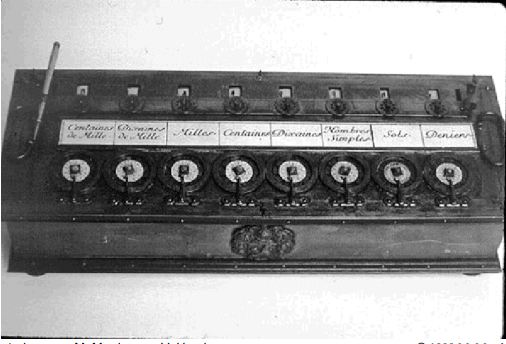

# Introdução à Arquitetura de Computadores

## Definições Básicas

- A **Arquitetura de Computadores** refere-se ao conjunto de características visíveis ao programador, ou seja, a forma como um sistema computacional é projetado para executar programas. Isso inclui aspectos como o conjunto de instruções da CPU, o tamanho dos tipos de dados (por exemplo, um inteiro de 32 bits) e os modos de endereçamento da memória.
- A **Organização de Computadores**, por outro lado, trata da estrutura interna do hardware, que não é diretamente perceptível pelo programador. Isso envolve elementos como a frequência do processador, a hierarquia de memória (caches, RAM) e a interconexão dos componentes internos.

### Níveis de Abstração na Arquitetura

Os computadores podem ser estudados em diferentes níveis de abstração, desde o nível mais alto, onde os usuários interagem com programas, até o nível mais baixo, formado por circuitos eletrônicos e transistores. Esses níveis incluem:

- **Nível do Usuário**: Onde os programas são executados.
- **Nível de Linguagem de Máquina**: Define o conjunto de instruções que o processador pode entender.
- **Nível de Microarquitetura**: Define a implementação interna do processador e como as instruções são executadas.
- **Nível Físico**: Onde transistores e circuitos eletrônicos realizam operações básicas.

A compreensão da Arquitetura de Computadores é essencial para projetar sistemas eficientes e otimizar o desempenho de softwares e hardwares.

---

## Máquina de Cálculo de Pascal

- A **Máquina de Pascal**, criada na primeira metade do século XVII por Blaise Pascal, foi um dos primeiros dispositivos mecânicos capazes de realizar operações aritméticas básicas, como soma e subtração. No entanto, essa máquina não possuía os componentes fundamentais de um computador moderno.
- Foi apenas no século XIX que **Charles Babbage** desenvolveu a ideia de um computador mecânico mais avançado. Ele projetou a **Máquina Analítica**, que combinava controle mecânico e cálculo automatizado, incluindo elementos que mais tarde se tornariam essenciais nos computadores digitais, como a unidade lógica e de controle.

---

## O Modelo de Von Neumann

O **modelo de Von Neumann**, proposto por John von Neumann em 1945, é a base da maioria dos computadores modernos. Ele é estruturado em cinco componentes principais:

1. **Unidade de Entrada** – Permite a inserção de dados no sistema (ex.: teclado, mouse).
2. **Unidade de Saída** – Exibe os resultados do processamento (ex.: monitor, impressora).
3. **Unidade Lógica e Aritmética (ULA)** – Responsável por realizar cálculos matemáticos e operações lógicas.
4. **Unidade de Memória** – Armazena dados e instruções temporariamente para execução.
5. **Unidade de Controle** – Coordena e gerencia a execução das instruções do programa.

Esse modelo é fundamental na computação, pois define a arquitetura onde programas e dados compartilham o mesmo espaço de memória, permitindo a execução sequencial de instruções.

---

## O Modelo de Barramento de Sistema

O **modelo de barramento de sistema** é um refinamento do modelo de Von Neumann, no qual a comunicação entre os componentes do computador ocorre por meio de um caminho compartilhado chamado **barramento de sistema** (*system bus*). Esse modelo é composto por três elementos principais:

- **CPU** – Inclui a Unidade Lógica e Aritmética (ULA) e a Unidade de Controle, responsáveis pelo processamento e execução das instruções.
- **Memória** – Armazena temporariamente dados e instruções para serem processados.
- **Unidade de Entrada/Saída (I/O)** – Permite a interação do computador com dispositivos externos, como teclado, mouse e impressora.

O **barramento de sistema** é subdividido em três barramentos principais:

1. **Barramento de Dados** – Transporta os dados entre a CPU, a memória e os dispositivos de I/O.
2. **Barramento de Endereços** – Define o local na memória ou no dispositivo onde os dados serão lidos ou gravados.
3. **Barramento de Controle** – Coordena e regula o fluxo de dados, garantindo que as operações sejam realizadas corretamente.

Além desses, há um **barramento de energia** para fornecer alimentação elétrica, e algumas arquiteturas possuem um **barramento de I/O separado**, dedicado exclusivamente à comunicação com dispositivos externos.

---

## Níveis de Máquinas

- Os computadores são organizados em diferentes **níveis de abstração**, cujo número exato pode variar conforme a abordagem adotada. Esses níveis vão desde o **nível do usuário**, onde a interação ocorre por meio de software, até o **nível dos transistores**, que compõem os circuitos eletrônicos básicos.
- À medida que se desce na hierarquia, os níveis se tornam menos abstratos, revelando mais detalhes da estrutura interna do computador e seu funcionamento em nível de hardware

---

## Um Computador Típico

---

## A Placa Mãe

- Os **5 componentes do modelo de Von Neumann** são representados fisicamente na **placa-mãe** do computador, assim como no **barramento de sistema**. Esses componentes, como a CPU, memória e unidades de entrada/saída, são conectados e interagem através do barramento, permitindo a comunicação e o processamento de dados no sistema.

---

## Manchester University Mark I

- Os **supercomputadores**, embora produzidos em baixa escala e com alto custo, foram muitas vezes substituídos por **máquinas de baixo custo**, fabricadas em grande volume. Essas máquinas oferecem uma **melhor relação preço-desempenho**, tornando-se mais acessíveis e eficientes para diversas aplicações.

---

## A Lei de Moore

- O **poder computacional** que se adquire por um preço constante tende a **dobrar a cada 18 meses**.
- Ao planejar um projeto, é fundamental considerar essa tendência: uma **inovação arquitetural** que visa quadruplicar o desempenho em três anos pode não ser relevante, por duas razões:
    - **Arquiteturas existentes** podem já ser capazes de oferecer o desempenho esperado de quadruplicar em breve, sem a necessidade de inovação.
    - **As inovações** podem exigir arquiteturas completamente diferentes das que estão sendo desenvolvidas, tornando a inovação pouco eficaz.