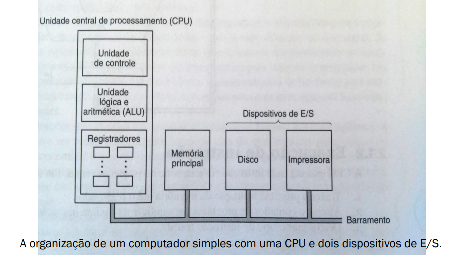

# Processadores

## 🧠 Introdução

> A CPU (Central Processing Unit – Unidade Central de Processamento) é o cérebro do computador. Tudo o que acontece em um sistema computacional passa, de alguma forma, pela sua unidade de processamento. Este conteúdo apresenta as principais arquiteturas e conceitos relacionados ao funcionamento dos processadores modernos.
> 

---

## 🔎 O que é um processador (CPU)?

- CPU = Central Processing Unit
- Executa instruções dos programas armazenados na memória
- Interpreta e processa cada comando em sequência
- Faz parte do núcleo central do hardware de qualquer computador

<aside>
💡 *Tudo que você faz – abrir um app, jogar, acessar um site – passa pela CPU!*

</aside>

---

## 🏗️ Organização da CPU (Modelo de Von Neumann)

A arquitetura de Von Neumann organiza a CPU em:

- **Unidade de controle**
- **Unidade lógica e aritmética (ULA)**
- **Registradores**
- **Memória principal compartilhada**
- **Barramento único de comunicação**

Esse modelo é usado até hoje em praticamente todos os computadores modernos.

---

## 📖 Execução de Instrução

A CPU executa cada instrução em uma série de pequenas etapas. Em
termos simples, as etapas são as seguintes:

- Trazer a próxima instrução da memória até o registrador;
- Alterar o contador de programa para indicar a próxima instrução;
- Determinar o tipo de instrução trazida;
- Se a instrução usar uma palavra na memória, determinar onde essa
palavra está;
- Trazer a palavra para dentro de um registrador da CPU, se
necessário;
- Executar a instrução;
- Voltar à etapa 1 para iniciar a execução da instrução seguinte

---

## 🔁 Ciclo de instrução: Fetch – Decode – Execute

**Etapas básicas:**

1. **Fetch:** Busca a instrução da memória
2. **Decode:** Decodifica a operação
3. **Execute:** Executa a operação

Esse ciclo se repete indefinidamente durante o funcionamento do processador.

---

## ⚔️ RISC x CISC

**RISC – Reduced Instruction Set Computer:**

✔ Conjunto pequeno de instruções

✔ Execução rápida e simples

✔ Alta eficiência

**CISC – Complex Instruction Set Computer:**

✔ Instruções mais complexas

✔ Menor quantidade de linhas de código

✔ Mais versátil, porém pode ser mais lento

🎯 CPUs modernas combinam ideias de ambas!

---

## 🧱 Princípios de projeto para CPUs modernas

- Executar instruções diretamente por hardware
- Facilitar a decodificação rápida
- Evitar acesso desnecessário à memória
- Usar **registradores em abundância**
- Otimizar o **paralelismo**
- Suportar múltiplos núcleos e threads

<aside>
💡  Quanto mais eficiente for o design, maior o desempenho e menor o consumo de energia.

</aside>

---

## 🚀 Pipeline (segmentação)

**Pipeline** é a divisão do ciclo de instruções em estágios independentes, como numa linha de produção.

**Vantagens:**

- Alta performance
- Mais instruções por segundo
- Redução do tempo de execução total

🧮 Exemplo:

5 estágios + 2ns por estágio = até 500 milhões de instruções por segundo.

---

## 🧠 Arquitetura Superescalar

- Executa **várias instruções simultaneamente** em pipelines paralelos
- Usa múltiplas **unidades funcionais** internas
- Base de processadores como Intel Core i5, i7, AMD Ryzen etc.

---

## 🧮 Paralelismo em processadores

Tipos de paralelismo:

- **Instrução:** Múltiplas instruções por ciclo
- **Processador:** Vários núcleos executando tarefas diferentes

🔧 Quanto mais paralelismo, maior a eficiência do sistema.

---

## 🧬 Vetoriais, Matriciais e Computação Científica

- **Processadores vetoriais/matriciais** trabalham com grandes blocos de dados simultaneamente
- Muito usados em áreas como IA, meteorologia, física, engenharia etc.
- Arquiteturas como **MMX** e **SSE** derivam desses conceitos

<aside>
💡 O PlayStation 4 usa esse tipo de arquitetura híbrida.

</aside>

### 💻 COMPUTADORES MATRICIAIS

Há dois métodos que têm sido usados para executar grandes programas
científicos rapidamente:

- Um processador matricial consiste em um grande número de
processadores idênticos que efetuam a mesma sequência de instruções
em diferentes conjuntos de dados.
- Um processador vetorial se parece muito com um processador matricial.
Assim como um processador matricial, ele é muito eficiente para executar
uma sequência de operações em pares de elementos de dados.

### 🔍 Processadores e Vetores Matriciais

- Processadores matriciais, bem como processadores vetoriais, trabalham com
matrizes de dados. Ambos executam instruções únicas que, por exemplo, somam
os elementos aos pares para os dois vetores.
- Embora atualmente não haja nenhum processador matricial em produção, a
ideia está longe de perecer. As instruções MMX e SSE disponíveis no Pentium 4
usam esse modelo de execução para acelerar software de multimídia. Nesse
aspecto particular, o ILLIAC IV é um dos ancestrais do Pentium 4.

---

## 🖥️ Multiprocessadores x Multicomputadores

**Multiprocessadores:**

- Várias CPUs com memória **compartilhada**
- Mais fáceis de programar

**Multicomputadores:**

- Cada CPU com sua **própria memória**
- Comunicação por troca de mensagens
- Mais fáceis de construir em larga escala

<aside>
💡 👨‍🔬 *Sistemas híbridos estão sendo estudados para unir o melhor dos dois mundos.*

</aside>

**Multiprocessador de Barramento único.** ⬆️

**Multicomputador com Memórias Locais.** ⬆️

---

## 📊 Exemplos de arquiteturas reais

- Intel Pentium 4 (Northwood, Prescott)
- Intel Core 2ª, 4ª, 5ª geração
- AMD FX Bulldozer
- PlayStation 4 – APU customizada

<aside>
💡 🔍 Todas essas CPUs utilizam paralelismo, pipelining e outras otimizações.

</aside>

---