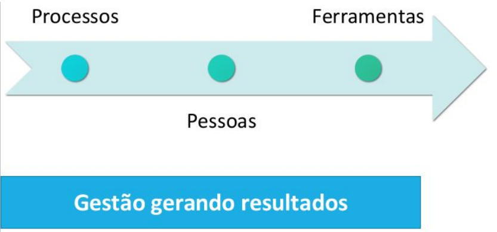

# Gestão de T.I 💼

## Diferença entre Gestão x Técnica

Este material aborda a diferença entre gestão e parte técnica na área de TI, destacando a importância da atuação estratégica da gestão, a realidade das empresas e o papel da TI como aliada nos negócios.

### O que é Gestão?

Diferença entre Gestão x Técnica?

- Gerenciar pra quê?
- Cenário atual
- Custo da TI
- Como fazer

| Gestão de TI | Técnica de TI |
| --- | --- |
| Foca em planejamento, organização e metas | Foca na execução e operação direta |
| Usa ferramentas como ITIL, COBIT, etc. | Usa ferramentas como linguagens, redes |
| Comunicação com áreas de negócio | Comunicação com infraestrutura |
| Responsável por decisões estratégicas | Responsável por soluções operacionais |

---

A Gestão de TI implica a **utilização sensata** de meios (recursos, pessoas, processos, práticas) para alcançar um objetivo. Atua no planejamento, construção, organização e controle das atividades operacionais e se alinha com a direção definida pela organização.

Portanto, a **gestão controla as tarefas operacionais**, enquanto a governança controla a gestão.

A governança corporativa de TI não é de responsabilidade exclusiva dos gestores de TI e, sim, da alta administração.

---

**O que é: Gestão de T.I**

> "...alocar adequadamente recursos disponíveis e gerenciá-los de forma
integrada, fazendo com que a qualidade do conjunto seja percebida pelos
seus clientes e usuários, evitando-se a ocorrência de problemas na entrega
e na operação dos serviços de TI."
Ivan Luizio Magalhães
> 

---

## Gerenciar pra quê?

- Necessidade de profissionalismo da TI nas empresas.
- Mercado aquecido
- Falta de profissionais qualificados

---

## Cenário atual 🧩

**Muitas empresas já perceberam a importância da TI para
os negócios.**
Com essa informação, partem para automatizarem seus processos agregando valor, competitividade para entrega aos clientes

Porém, o que vemos por aí é:

- Aplicações mal parametrizadas;
- Mudanças sem planejamento;
- Falta de controle da capacidade e demanda da Ti;
- Falhas em procedimentos;
- Falha nos acordos;
- Erros que comprometam a organização;

---

## Quanto custa a T.I? 📋

- Já parou pra pensar?
- Você acha que o custo da TI é só funcionário?
- Energia Elétrica, Internet, Água
- Funcionário – Salários e encargos
- Hardwares – Adquiridos
- Softwares – Licenças
- Suprimentos – Impressão
- **Você já parou para precificar quanto custa a TI de sua empresa?**

---

### Qual o valor da T.I para o negócio? 🏷️

Quanto uma organização alvo depende de serviços de TI para a consecução dos seus negócios, podem vir a perder por uma hora de interrupção em um dos seus serviços de TI?

Quais os serviços de TI são primordiais para sua empresa?

### Como fazer?

Desenhando, implementando e gerenciando os processos internos da área de TI de acordo com boas práticas reunidas na ITIL.

---

## Ativos de TI ⚙️

<aside>
💡

Tudo que tem valor para a TI.

</aside>

Ativos são todos os itens da organização onde informações são:

- criadas,
- processadas,
- armazenadas,
- transmitidas ou descartadas.

O gerenciamento de ativos é fundamental para priorizar investimentos e concentrar esforços nos ativos mais críticos, que sustentam os processos da organização.

## Gerir ativos é bom?

**Gestão de Ativos de TI evita:**

- desperdícios com investimentos inapropriados,
- otimiza as atividades do negócio,
- permite a aderência a vários controles de normas de
gestão,
- além de qualidade e segurança

### Gerindo ativos de TI

A falta de GATI inevitavelmente leva a aumento de custos elevando o preço do produto final ou serviço.

**Como funciona?**

A gestão patrimonial de ativos procura identificar e catalogar os bens físicos de uma organização, para averiguar se determinado ativo existe e seu statuos quo, bem como sua localização, utilização e prazo de vida.

**No dia-a-dia**
Essa função sempre esteve muito ligada aos setores contábil e fiscal, responsáveis por inventariarem ativos físicos em uma organização através de plaquetas com numerações sequenciais associadas a um documento contendo suas principais características

**Atualmente**

Aos poucos os departamentos de TI estão assumindo a responsabilidade por essa gestão patrimonial de uma empresa.

Ter todas as atividades detalhadas e principalmente atualizadas dos equipamentos de informática e softwares utilizados em uma organização, não só é uma prática necessária para a localização dos
ativos, como também permite identificar fatores como:

- Desperdício de recursos ou subutilização
- Ferramentas inadequadas para a realização de atividades dos
funcionários
- Depredação dos equipamentos
- Fraudes ocasionadas por furtos ou extravios.

---

## Ativos de Informação 📚

Base de dados e arquivos

Contratos e acordos

Documentação de sistema

Informações sobre pesquisa

Manuais de usuário

Material de treinamento

Procedimentos de suporte ou operação

Planos de continuidade do negócio

Procedimentos de recuperação

Trilhas de auditoria e informações armazenadas

## Ativos de Software 💻

Aplicativos

Sistemas

Ferramentas de Desenvolvimento

Utilitários

## Ativos Físicos 🛠️

Equipamentos Computacionais

Equipamentos de Comunicação

Mídias Removíveis

Outros Equipamentos

**Indicadores em Gestão de TI 📊**

Para avaliar a eficiência da gestão, é importante acompanhar métricas como:

- Tempo médio de atendimento (TMA)
- Nível de satisfação dos usuários
- Disponibilidade dos serviços (uptime)
- Custo por chamado resolvido
- Taxa de resolução no primeiro contato (FCR)

<aside>
💡

Na descrição dos tipos de ativos, fica compreensível entender os motivos que levaram a TI a assumir parcialmente a tarefa de inventariar e gerir itens, uma vez que boa parte deles necessita de conhecimentos técnicos para realizar a sua correta identificação, manutenção e em muitos casos valorização estimada do ativo para a organização

</aside>