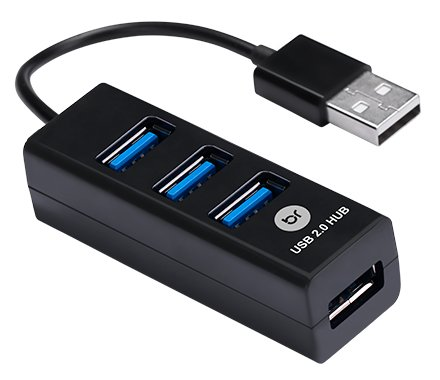
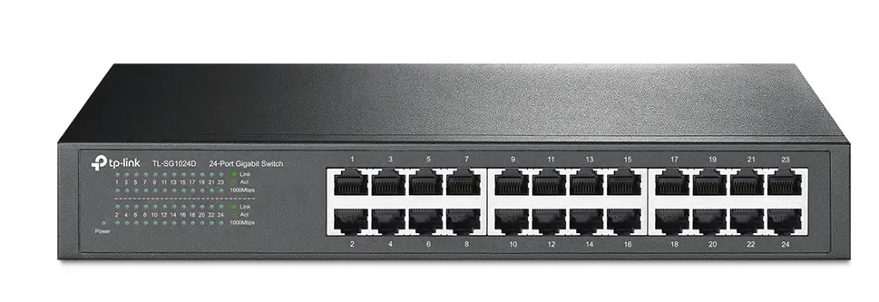
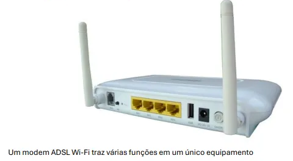

# Ativos de Rede

As redes de computadores são a espinha dorsal da comunicação digital moderna,
permitindo o compartilhamento de recursos, a transferência de dados e a
conexão entre dispositivos. Para que uma rede funcione de maneira eficiente,
diversos dispositivos, conhecidos como ativos de rede, são utilizados. Entre eles,
destacam-se os hubs, switches, roteadores e gateways. Cada um desses
dispositivos possui características e funcionalidades específicas, atuando em
diferentes camadas do modelo OSI (Open Systems Interconnection). Este artigo
tem como objetivo explorar em detalhes as características técnicas e os papéis
desempenhados por esses ativos, fornecendo uma visão aprofundada para
estudantes de graduação na área de Tecnologia da Informação.

## 1. Hubs

Os hubs são dispositivos de rede básicos que operam na camada física (Layer 1)
do modelo OSI. Eles são utilizados para conectar múltiplos dispositivos em uma rede local (LAN), permitindo a comunicação entre eles. No entanto, os hubs são
considerados dispositivos "burros", pois não possuem capacidade de
processamento para gerenciar o tráfego de dados.

### **Características dos Hubs:**

- Funcionamento: Quando um pacote de dados chega a uma porta do hub,
ele é replicado e enviado para todas as outras portas, independentemente
do destinatário. Isso é conhecido como domínio de colisão, onde todos os
dispositivos compartilham o mesmo meio de comunicação.
- Desempenho: Como o tráfego é enviado para todas as portas, os hubs são
propensos a colisões de dados, especialmente em redes com alto volume
de tráfego. Isso limita sua eficiência e escalabilidade.
- Aplicações: Hubs eram comuns em redes pequenas e antigas, mas hoje
são considerados obsoletos, tendo sido substituídos por switches, que
oferecem maior eficiência e controle.

### Limitações

- Não possuem capacidade de filtrar ou direcionar pacotes.
- Não suportam comunicação full-duplex (transmissão e recepção
simultânea).
- Ineficientes em redes com muitos dispositivos.

---

## 2. Switches

Os switches são dispositivos mais avançados que operam na camada de enlace
(Layer 2) do modelo OSI, embora existam switches que também operam na
camada de rede (Layer 3), conhecidos como switches multicamadas. Eles são
amplamente utilizados em redes locais (LANs) para conectar dispositivos e
gerenciar o tráfego de dados de forma inteligente.

### Características dos Switches:

- Funcionamento: Ao contrário dos hubs, os switches são capazes de
identificar o endereço MAC (Media Access Control) dos dispositivos
conectados a eles. Eles mantêm uma tabela de endereços MAC, chamada
MAC Address Table, que mapeia cada dispositivo à sua porta
correspondente. Isso permite que os pacotes de dados sejam enviados
apenas para o destinatário correto, reduzindo colisões e melhorando o
desempenho da rede.
- Desempenho: Switches suportam comunicação full-duplex, permitindo
que dispositivos transmitam e recebam dados simultaneamente. Além
disso, eles segmentam a rede em domínios de colisão separados, o que
aumenta a eficiência.

### Funcionalidades Avançadas

- **VLANs (Virtual Local Area Networks):** Permitem a segmentação lógica da
rede em grupos isolados, melhorando a segurança e o gerenciamento.
- **Spanning Tree Protocol (STP):** Evita loops na rede, garantindo redundância
sem causar congestionamento.
- **Switches Layer 3:** Podem realizar roteamento básico entre VLANs,
funcionando como roteadores simplificados.

### Aplicações

- Conexão de computadores, impressoras e outros dispositivos em redes
locais.
- Gerenciamento de tráfego em redes corporativas e data centers.

---

## 3. Roteadores

Os roteadores são dispositivos essenciais para a interconexão de redes
diferentes, como uma rede local (LAN) e a internet. Eles operam na camada de
rede (Layer 3) do modelo OSI, utilizando endereços IP (Internet Protocol) para
encaminhar pacotes de dados entre redes.

### Características dos Roteadores:

- Funcionamento: Roteadores utilizam tabelas de roteamento para
determinar o melhor caminho para os pacotes de dados chegarem ao seu
destino. Eles podem usar protocolos de roteamento dinâmico, como OSPF
(Open Shortest Path First) e BGP (Border Gateway Protocol), ou roteamento
estático, onde as rotas são configuradas manualmente.
- Desempenho: Roteadores são projetados para lidar com grandes volumes
de tráfego entre redes, oferecendo alta capacidade de processamento e
largura de banda.

### Funcionalidades Avançadas

- **NAT (Network Address Translation):** Permite que múltiplos dispositivos em
uma rede local compartilhem um único endereço IP público para acessar a
internet.
- **Firewall:** Oferece segurança ao filtrar tráfego indesejado e bloquear
ataques.
- **QoS (Quality of Service):** Prioriza o tráfego de dados críticos, como voz e
vídeo, garantindo melhor desempenho.

### Aplicações:

- Conexão de redes locais à internet.
- Interconexão de redes em diferentes locais (WANs).
- Roteamento em redes corporativas e provedores de internet.

---

## 4. Gateways

Gateways são dispositivos ou softwares que atuam como intermediários entre
redes que utilizam protocolos diferentes. Eles são capazes de traduzir e converter
dados para que redes incompatíveis possam se comunicar. Gateways operam em
várias camadas do modelo OSI, dependendo da complexidade da conversão
necessária. Características dos Gateways:

### Características do Gateway

- Funcionamento: Um gateway pode converter protocolos de comunicação,
formatos de dados ou até mesmo endereçamentos. Por exemplo, um
gateway pode ser usado para conectar uma rede IP a uma rede que utiliza
um protocolo antigo, como X.25 ou SNA (Systems Network Architecture).
- Desempenho: Gateways são dispositivos especializados que exigem alto
poder de processamento para realizar conversões complexas em tempo
real.

### Funcionalidades Avançadas

- **Tradução de Protocolos:** Converte dados entre redes que utilizam
protocolos diferentes.
- **Integração de Sistemas:** Permite a comunicação entre sistemas
heterogêneos, como redes industriais e redes corporativas.
- **Segurança:** Pode incluir funcionalidades de firewall e criptografia para
proteger a comunicação entre redes.

### Aplicações

- Conexão de redes industriais (como redes SCADA) a redes corporativas.
- Integração de sistemas legados com redes modernas.
- Comunicação entre redes que utilizam tecnologias diferentes (por
exemplo, IPv4 e IPv6).

---

## 5. Modems

Os modems (Modulador/Demodulador) são dispositivos que convertem sinais
digitais em analógicos e vice-versa, permitindo a transmissão de dados através de
linhas telefônicas ou outros meios de comunicação analógicos. Eles operam na
camada física (Layer 1) do modelo OSI e são essenciais para a conexão à internet
em tecnologias como DSL, cabo e dial-up.

### Características dos Modems:

- Funcionamento: Os modems modulam os sinais digitais do computador
em sinais analógicos que podem ser transmitidos através de linhas
telefônicas. No destino, o modem demodula os sinais analógicos de volta
para o formato digital.
- Desempenho: A velocidade de transmissão de dados de um modem
depende da tecnologia utilizada. Por exemplo, modems DSL oferecem
velocidades superiores em comparação com modems dial-up.

### Funcionalidades Avançadas:

- **Conexão à Internet:** Modems são usados para conectar redes locais à
internet através de provedores de serviços.
- **Suporte a Múltiplas Tecnologias:** Modems podem suportar diferentes
tecnologias, como ADSL, VDSL e cabo.
- **Integração com Roteadores:** Muitos modems modernos são combinados
com roteadores, oferecendo funcionalidades de rede local e acesso à
internet em um único dispositivo.

### Aplicações

- Conexão à internet em residências e pequenos escritórios.
- Transmissão de dados através de linhas telefônicas em áreas remotas.
- Integração com roteadores para fornecer acesso à internet e
gerenciamento de rede local.

---

## Convergência entre dispositivos

Estes aparelhos contam com as funções de switch, modem e roteador. Nestes
casos, o principal beneficiado é o consumidor, que pode usar um aparelho sem
ter que se preocupar muito com os detalhes de suas funções, pois normalmente
eles são bem integrados. Entretanto, mesmo estes produtos exigem do usuário
algum conhecimento prévio dos conceitos de redes abordados aqui, para serem
bem utilizados.
Do lado oposto dos aparelho com múltiplas funções, é bom lembrar também que
alguns fabricantes colocam no mercado equipamentos com o nome de switch,
mas que, na verdade, são hubs. Nesta situação, é importante que avaliá-los bem 

e informar-se antes de comprá-los. Uma dica vale para qualquer equipamento: dê
preferência a marcas conhecidas, porque isso pode evitar transtornos no futuro.
O resumo disso tudo é que, mesmo com equipamentos melhorados e cada dia
mais fáceis de serem usados, quando se trata de redes, é sempre bom entender
um pouco mais para não correr o risco de comprar algo poderoso ou simplório
demais para as suas necessidades

---

## Kit conversor de mídia, ONT/ONU

Os aparelhos que recebem o sinal de fibra óptica em casa são chamados de ONT
(Optical Network Terminal) ou ONU (Optical Network Unit). Esses dispositivos são
essenciais para converter o sinal óptico transmitido pela fibra em sinais elétricos
que podem ser utilizados pelos equipamentos domésticos, como roteadores,
computadores, TVs e telefones.

### Características da ONT/ONU:

- Conversão de Sinais: A ONT/ONU converte o sinal óptico (luz) que chega
pela fibra em sinais elétricos compatíveis com dispositivos Ethernet, Wi-Fi,
telefones VoIP e outros.

### Portas de Conexão:

- Porta de Fibra Óptica: Recebe o sinal óptico diretamente da rede do
provedor.
- Portas Ethernet: Conectam a ONT a roteadores, computadores ou outros
dispositivos via cabo.
- Porta de Telefone (VoIP): Permite a conexão de telefones para serviços de
voz sobre IP.
- Porta de Vídeo (opcional): Em alguns modelos, há suporte para
transmissão de TV por IP (IPTV)

### Funcionalidades:

- Suporta tecnologias como GPON (Gigabit Passive Optical Network) ou
XGS-PON (para redes mais avançadas).
- Pode incluir funcionalidades de roteamento Wi-Fi, integrando o modem e o
roteador em um único dispositivo (conhecido como roteador ONT).

