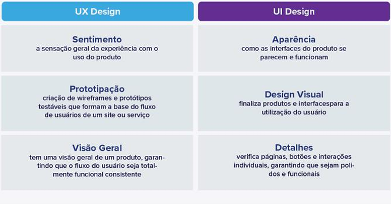

# UX/UI

## O que é UX?

UX significa user experience e é sobre a **relação entre o usuário e um determinado produto ou serviço.**

Nesse sentido, o UX é o responsável pelo planejamento e organização de como um produto funciona para que seja fácil e agradável para a pessoa usuária.

Para isso, os objetivos do UX Design são:

- **satisfazer as necessidades** da pessoa usuária;
- **ajudar a desenvolver** produtos/serviços fáceis de usar;
- dar **controle e liberdade** para as pessoas usuárias;
- surpreender e agradar.

Dessa forma, o UX Design tem a função de proporcionar uma jornada mais fluída e agradável, melhorando a interação e a experiência entre as pessoas usuárias e as interfaces.

## O que é UI?

UI significa User Interface, o que geralmente se refere a interfaces gráficas com as quais as pessoas usuárias conseguem interagir.

Dessa forma, UI Designers trabalham com o aspecto visual de um produto digital, ou seja, o quão agradável é a estética da interface.

Existem 3 tipos de formatos de interface:

- **Interfaces gráficas**: as pessoas usuárias interagem com as representações visuais em um painel de controle. A área de trabalho de um computador é uma interface gráfica, por exemplo;
- **Interfaces de controle de voz**: quando a interação acontece por voz, como com as assistentes virtuais Siri ou Alexa;
- **Interfaces gestuais**: quando a interação acontece através de espaços em 3D e movimentos corporais, como em jogos de realidade virtual.

---

## Principais diferenças entre UX e UI Design

O UX Design é o **processo** pelo qual um profissional ou uma equipe **identificam uma dor ou necessidade do usuário**. Em seguida, esta dor precisa ser validada ou invalidada utilizando pesquisas, prototipagem ou diversos outros processos dependendo da fase em que o projeto se encontra.

Já o **UI Design** é responsável pelo **desenvolvimento da interface,** que pode ser visual ou não, do site, aplicativo ou sistema; e pela forma como as pessoas **interagem** com ela.

