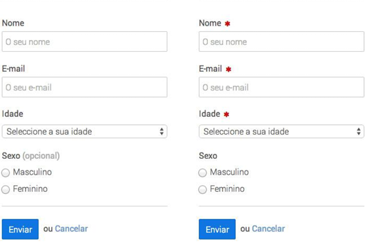

# Usabilidade

*Eu sou o usuário que abre a página do seu site e aguarda segundos, minutos, horas enquanto sua página carrega.*

*Eu sou o usuário que tenta voltar à página anterior, mas nunca consegue.*

*Eu sou o usuário que tenta, insistentemente, ler as notificações do seu site no meu celular, mesmo quando elas somem na tela.*

*Eu sou o usuário que não enxerga tão bem e, sem querer, acabo clicando em algum pop-up, mas nunca mais consigo fechá-lo.*

*Você pode está pensando que sou num usuário muito calmo, paciente e empático com todos os problemas que seu site me entrega de presente. Se você pensou assim, se enganou!*

***Eu sou o usuário que nunca mais acessará seu site.***

## Consequências da falta de Usabilidade

As frases que você acabou de ler foram inspiradas no discurso conhecido como ”O cliente que nunca mais volta”,  de Sam Walton, fundador de uma das maiores redes de supermercados do mundo, o Walmart.

Ao iniciar um treinamento para novos funcionários, ele começa citando várias situações nas quais os clientes podem acabar não fazendo alarde algum, mas que, ao passar por elas, nunca mais retornariam a comprar daquela empresa.

Adaptamos essas frases para que você visualize com mais facilidade as situações nas quais **a falta de usabilidade** pode fazer com o que um usuário:

- nunca mais retorne ao seu site;
- nunca mais efetue uma compra em seu *e-commerce*;
- exclua seu aplicativo do celular;
- tenha um sentimento negativo a respeito da marca.

## Mas afinal, o que é Usabilidade?

Usabilidade é a qualidade de um sistema, produto ou interface que permite aos usuários interagirem com facilidade, eficiência e satisfação. Um produto com boa usabilidade é intuitivo, reduz erros e melhora a experiência do usuário.

Quando falamos em "facilidade" **também deve estar incluso o aspecto funcional**: **não adianta a interface ser fácil de usar, mas não resolver as necessidades do usuário.**

Usabilidade é você:

- Acessar um site e ter **facilidade de navegação**;
- Fazer o download de um aplicativo e conseguir, sem ver instrução alguma, ou seja, **intuitivamente**, completar alguma atividade;
- Usar algo que parece que foi feito **sob medida** para você;
- Não sentir raiva de quem **desenvolveu** o que você está usando.

## Características da Usabilidade

- **Facilidade de aprendizado** → O usuário consegue
aprender a usar rapidamente?
- **Eficiência** → O usuário realiza tarefas de forma ágil e
sem esforço?
- **Memorabilidade** → O usuário se lembra facilmente de
como utilizar o sistema após um tempo sem usá-lo?
- **Erros** → O sistema evita erros? Se ocorrem, são fáceis
de corrigir?
- **Satisfação** → O usuário tem uma experiência
agradável ao utilizar o produto

---

## O que modelos mentais tem a ver com Usabilidade?

- Construímos **modelos mentais** por experiências adquiridas no passado, no uso das coisas no dia a dia.
- Esses modelos passam a fazer parte do nosso **repertório** e se tornam **heurísticas**.
- São **heurísticas** que nosso cérebro acessa para **gastar menos esforço**.
- Cérebro preguiçoso, **design bom!** 🧠✨

## 🧠 O que são **modelos mentais**?

Modelos mentais são as **ideias e suposições que as pessoas têm sobre como algo funciona**, baseadas em experiências anteriores.

> Exemplo: Se você sempre usou um botão para tocar música, você espera que esse botão funcione da mesma forma em qualquer app. Esse é seu modelo mental sobre "botão de play".
> 

---

## 💻 E a relação com **usabilidade**?

Usabilidade trata de **quão fácil e intuitivo é usar um sistema**. Se o design respeita os modelos mentais dos usuários, o sistema será:

- ✅ Mais fácil de entender
- 🚀 Mais rápido de aprender
- 😃 Mais agradável de usar
- ❌ Menos propenso a causar erros

Se o sistema **não seguir** os modelos mentais dos usuários, a experiência será confusa e frustrante.

---

## 🎯 Exemplo prático

Um ícone de 🗑️ lixeira para deletar algo funciona bem porque os usuários **esperam** que jogar fora = excluir.

Mas se você usar, por exemplo, um triângulo verde para excluir algo, os usuários não vão entender. Isso **quebra o modelo mental** deles.

---

## ✅ Conclusão

> Quanto mais um sistema respeita os modelos mentais dos usuários, melhor sua usabilidade.
> 

Projetar com base nos modelos mentais é um dos segredos para criar interfaces **intuitivas e eficientes**.

---

## 💡 Dica bônus

Antes de criar uma interface, pergunte:

- O que o usuário **espera** que aconteça ao clicar aqui?
- Isso parece com algo que ele **já conhece**?
- Estou reinventando algo que **não precisa ser reinventado**?

💡 Simplicidade, familiaridade e lógica são chaves para boa usabilidade.

---

## Boa e má usabilidade em formulários

**As mensagens de erros devem ser claras e devem ajudar o utilizador a corrigir ou ultrapassar os erros**

**As mensagens de erros devem estar junto do campo a que dizem respeito.**

**As mensagens de erros devem se destacar em todo o formulário**

**Cancelar o cancelamento**

---

## Usabilidade em cadastros

---

## Usabilidade em textos

### **H1 representa o tópico principal da página em questão**

É como o título de um capitulo.

---

## Usabilidade em botões

**A imagem a seguir está correta?**

